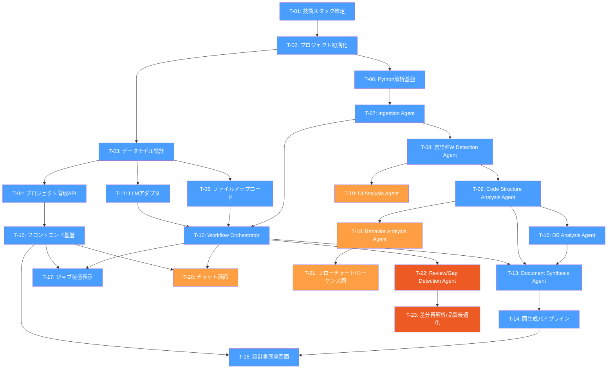
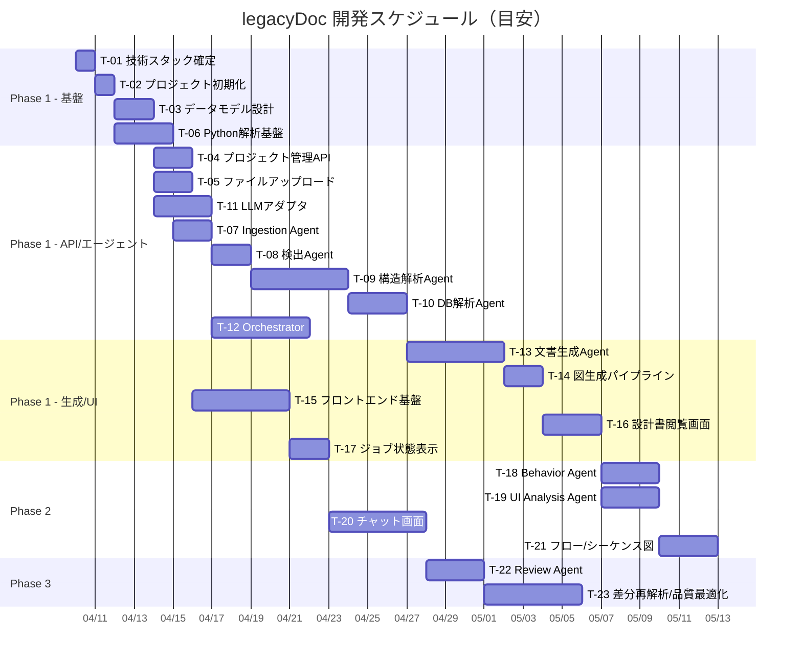

# legacyDoc 実装計画書（task_plan.md）

* 文書版数: 0.1
* 作成日: 2026-04-09
* 対象仕様書: [spec.md](file:///c:/work/legacyDoc/doc/spec.md)
* 目的: spec.md に記載されたレガシー解析・設計書自動生成エージェントを段階的に実装するための作業計画を定義する

---

## 1. 全体方針

### 1.1 開発アプローチ

* **Phase 1（MVP）**: プロジェクト管理・アップロード・基本解析・基本ドキュメント生成・閲覧を実装し、受入条件を満たす最小構成を完成させる
* **Phase 2（UI/チャット強化）**: 画面解析・フローチャート・シーケンス図・チャット再解析を追加し、対話型のユーザ体験を実現する
* **Phase 3（品質・最適化）**: 差分再解析・品質レビュー・推定信頼度・モデル切替最適化・テンプレート切替を追加する

### 1.2 技術スタック

| 領域 | 技術 | 補足 |
|------|------|------|
| フロントエンド | React (Vite) | Markdown Viewer, SVG Viewer, チャットUI |
| バックエンド（API） | TypeScript (Node.js / Express or Hono) | REST API, ジョブ管理 |
| バックエンド（解析） | Python | Tree-sitter, 構文解析, PlantUML生成 |
| DB | SQLite (開発) / PostgreSQL (運用) | Prisma or Drizzle ORM |
| ジョブキュー | BullMQ (Redis) or インプロセスキュー | 非同期ジョブ管理 |
| LLM連携 | Azure OpenAI / Ollama | ModelAdapter 抽象化 |
| 構文解析 | Tree-sitter (C/C++/Java) | Python バインディング |
| 図生成 | PlantUML → SVG | plantuml.jar or サーバモード |
| ファイルストレージ | ローカルファイルシステム | プロジェクト単位ディレクトリ |

### 1.3 リポジトリ構成（想定）

```text
legacyDoc/
├── doc/                        # ドキュメント
│   ├── spec.md
│   └── task_plan.md
├── frontend/                   # React (Vite)
│   ├── src/
│   │   ├── components/
│   │   ├── pages/
│   │   ├── hooks/
│   │   ├── services/          # API クライアント
│   │   └── App.tsx
│   └── package.json
├── backend/                    # TypeScript API サーバ
│   ├── src/
│   │   ├── controllers/
│   │   ├── services/
│   │   ├── models/
│   │   ├── agents/            # エージェント制御
│   │   ├── adapters/          # LLM アダプタ
│   │   ├── jobs/              # ジョブ管理
│   │   └── server.ts
│   └── package.json
├── analyzer/                   # Python 解析モジュール
│   ├── parsers/               # Tree-sitter パーサ
│   ├── extractors/            # シンボル・構造抽出
│   ├── generators/            # PlantUML / Markdown 生成
│   ├── agents/                # 各エージェントロジック
│   └── requirements.txt
├── projects/                   # プロジェクトデータ (実行時)
└── docker-compose.yml          # 開発環境
```

### 1.4 依存関係グラフ



> [!NOTE]
> 🔵 青: Phase 1（MVP） / 🟠 橙: Phase 2（UI/チャット強化） / 🔴 赤: Phase 3（品質・最適化）

---

## 2. Phase 1 — MVP（受入条件達成）

### T-01: 技術スタック確定・開発環境構築

| 項目 | 内容 |
|------|------|
| タスクID | T-01 |
| 依存 | なし |
| 概要 | 採用する技術スタックを最終確定し、開発環境（Docker, Node.js, Python, DB）を構築する |

**実装内容:**

1. フロントエンド・バックエンド・解析モジュールの具体的なライブラリバージョンを確定する
2. `docker-compose.yml` を作成し、以下を含む開発環境を構築する
   - Node.js コンテナ（API サーバ）
   - Python コンテナ（解析モジュール）
   - Redis コンテナ（ジョブキュー用、BullMQ 採用時）
   - DB コンテナ（PostgreSQL）またはローカル SQLite
   - PlantUML サーバコンテナ
3. Linter / Formatter / テスト基盤を設定する（ESLint, Prettier, Vitest, pytest）
4. CI 用の基本設定ファイルを用意する

**成果物:**

- [ ] `docker-compose.yml`
- [ ] 各モジュールの `package.json` / `requirements.txt`
- [ ] Linter / Formatter 設定ファイル
- [ ] 動作確認済みの開発環境

**受入条件:**

- `docker compose up` で全コンテナが起動する
- 各モジュールの hello world レベルの動作確認ができる

---

### T-02: プロジェクト初期化（モノレポ構成）

| 項目 | 内容 |
|------|------|
| タスクID | T-02 |
| 依存 | T-01 |
| 概要 | フロントエンド・バックエンド・解析モジュールのプロジェクト雛形を作成する |

**実装内容:**

1. `frontend/`: Vite + React + TypeScript プロジェクトを初期化する
   - React Router を導入する
   - 基本的な CSS 設計（CSS Modules or Vanilla CSS）を決定する
2. `backend/`: TypeScript プロジェクトを初期化する
   - Express or Hono をセットアップする
   - ルーティング雛形を作成する
3. `analyzer/`: Python プロジェクトを初期化する
   - 仮想環境を作成する
   - ディレクトリ構成を作成する
4. プロジェクト間通信方式を決定する（REST / gRPC / プロセス間呼出し）

**成果物:**

- [ ] `frontend/` 初期プロジェクト
- [ ] `backend/` 初期プロジェクト
- [ ] `analyzer/` 初期プロジェクト
- [ ] README.md（セットアップ手順）

**受入条件:**

- フロントエンドが `npm run dev` で起動し、ブラウザにページが表示される
- バックエンドが起動し、ヘルスチェック API (`GET /health`) に応答する
- Python 解析モジュールのテストが実行できる

---

### T-03: データモデル設計・DB マイグレーション

| 項目 | 内容 |
|------|------|
| タスクID | T-03 |
| 依存 | T-02 |
| 概要 | spec.md §18 に基づくデータモデルを設計し、ORM スキーマとマイグレーションを作成する |

**実装内容:**

1. 以下のエンティティを定義する（spec.md §18 準拠）

   | エンティティ | 主要カラム |
   |---|---|
   | `Project` | id, name, description, status, created_at, updated_at, active_version_id |
   | `ProjectVersion` | id, project_id, label, upload_path, created_at |
   | `AnalysisJob` | id, project_id, version_id, status, started_at, finished_at, current_phase, summary |
   | `Artifact` | id, project_id, version_id, type, path, format, created_at |
   | `ChatMessage` | id, project_id, role, message, related_job_id, created_at |
   | `Evidence` | id, project_id, source_path, symbol_name, evidence_type, summary, confidence |

2. ORM スキーマファイルを作成する（Prisma or Drizzle）
3. マイグレーションを作成・実行する
4. シードデータ投入スクリプトを用意する

**成果物:**

- [ ] ORM スキーマ定義ファイル
- [ ] マイグレーションファイル
- [ ] シードスクリプト
- [ ] ER 図（PlantUML）

**受入条件:**

- マイグレーションが正常に実行される
- 各テーブルへの CRUD 操作がテストで確認できる

---

### T-04: プロジェクト管理 API

| 項目 | 内容 |
|------|------|
| タスクID | T-04 |
| 依存 | T-03 |
| 概要 | spec.md §17.1 に基づくプロジェクト管理 REST API を実装する |

**実装内容:**

1. 以下のエンドポイントを実装する

   | メソッド | パス | 機能 |
   |---|---|---|
   | `POST` | `/api/projects` | プロジェクト新規作成 |
   | `GET` | `/api/projects` | プロジェクト一覧取得 |
   | `GET` | `/api/projects/:id` | プロジェクト詳細取得 |
   | `PATCH` | `/api/projects/:id` | プロジェクト更新 |
   | `DELETE` | `/api/projects/:id` | プロジェクト削除 |

2. バリデーション（zod 等）を実装する
3. エラーハンドリングミドルウェアを実装する
4. 単体テストを作成する

**成果物:**

- [ ] `controllers/projectController.ts`
- [ ] `services/projectService.ts`
- [ ] バリデーションスキーマ
- [ ] 単体テスト

**受入条件:**

- 全エンドポイントが正常に動作する
- バリデーションエラー時に適切なレスポンスが返る
- 単体テストが全て通る

---

### T-05: ファイルアップロード機能

| 項目 | 内容 |
|------|------|
| タスクID | T-05 |
| 依存 | T-03 |
| 概要 | spec.md §11.2 / §17.2 に基づくファイルアップロード機能を実装する |

**実装内容:**

1. 以下のエンドポイントを実装する

   | メソッド | パス | 機能 |
   |---|---|---|
   | `POST` | `/api/projects/:id/upload` | ファイルアップロード（zip / 複数ファイル） |
   | `POST` | `/api/projects/:id/versions` | 新バージョン作成 |

2. アップロード処理の実装
   - `multer` 等によるマルチパートファイル受信
   - zip ファイルの展開（`adm-zip` or `unzipper`）
   - ディレクトリ構造を保ったファイル保存
   - `ProjectVersion` レコード作成
3. プロジェクトデータディレクトリの管理
   - spec.md §13.2 に準拠したディレクトリ構造を作成する
   ```
   /projects/{project_id}/
     /input/
     /working/
     /output/
     /chat/
     /meta/
   ```
4. ファイル一覧取得 API を実装する

**成果物:**

- [ ] `controllers/uploadController.ts`
- [ ] `services/fileService.ts`
- [ ] ディレクトリ管理ユーティリティ
- [ ] 単体テスト

**受入条件:**

- zip アップロードでファイルが展開・保存される
- 複数ファイルアップロードが動作する
- ディレクトリ構造が spec.md §13.2 に準拠する
- バージョン管理（上書き / 新バージョン）が動作する

---

### T-06: Python 解析基盤（Tree-sitter セットアップ）

| 項目 | 内容 |
|------|------|
| タスクID | T-06 |
| 依存 | T-02 |
| 概要 | Tree-sitter を用いた C / C++ / Java の構文解析基盤を構築する |

**実装内容:**

1. Tree-sitter のインストールと言語バインディングのセットアップ
   - `tree-sitter`（Python バインディング）
   - `tree-sitter-c`
   - `tree-sitter-cpp`
   - `tree-sitter-java`
2. 共通パーサインターフェースを定義する
   ```python
   class LanguageParser(ABC):
       def parse_file(self, file_path: str) -> ParseResult: ...
       def extract_symbols(self, tree: Tree) -> List[Symbol]: ...
       def extract_relationships(self, tree: Tree) -> List[Relationship]: ...
   ```
3. 各言語パーサの基本実装（C, C++, Java）
4. パース結果の共通中間構造を定義する
5. バックエンド ↔ Python 間の通信方式を実装する（REST API or サブプロセス呼出し）

**成果物:**

- [ ] `analyzer/parsers/base.py` — 共通インターフェース
- [ ] `analyzer/parsers/c_parser.py`
- [ ] `analyzer/parsers/cpp_parser.py`
- [ ] `analyzer/parsers/java_parser.py`
- [ ] 中間構造定義（JSON Schema）
- [ ] テストコード

**受入条件:**

- C / C++ / Java のサンプルコードから、関数・クラス・メソッドの一覧が抽出できる
- パース結果が共通中間構造に正規化される
- テストが全て通る

---

### T-07: Ingestion Agent

| 項目 | 内容 |
|------|------|
| タスクID | T-07 |
| 依存 | T-06 |
| 概要 | spec.md §8.1.1 に基づく Ingestion Agent を実装する |

**実装内容:**

1. アップロードファイルの前処理
   - 文字コード判定（`chardet` / `charset-normalizer`）
   - バイナリファイル除外
   - 除外対象判定（`.git`, `node_modules`, ビルド出力等）
2. ディレクトリ構造の収集と JSON 出力
3. ファイル分類（ソースコード / 設定ファイル / SQL / テンプレート / その他）
4. プロジェクトメタ情報の作成
   - ファイル数、行数、言語分布
   - ディレクトリツリー
5. 中間成果物の保存（`/working/index/`）

**成果物:**

- [ ] `analyzer/agents/ingestion_agent.py`
- [ ] 文字コード判定ユーティリティ
- [ ] ファイル分類ロジック
- [ ] テストコード

**受入条件:**

- サンプルプロジェクトのファイル一覧が正しく生成される
- 文字コードが自動判定される
- 除外対象が正しくフィルタされる
- メタ情報 JSON が `/working/index/` に保存される

---

### T-08: Language / Framework Detection Agent

| 項目 | 内容 |
|------|------|
| タスクID | T-08 |
| 依存 | T-07 |
| 概要 | spec.md §8.1.2 に基づく言語・フレームワーク検出エージェントを実装する |

**実装内容:**

1. 言語判定ロジック
   - ファイル拡張子ベース
   - ファイル内容ベース（シバン行、import 文パターン等）
   - 言語ごとのファイル数・行数集計
2. ビルドツール判定
   - Makefile / CMakeLists.txt → C/C++
   - pom.xml / build.gradle → Java (Maven / Gradle)
3. フレームワーク推定
   - Spring Boot（`@SpringBootApplication`, `application.properties`）
   - MyBatis（`mybatis-config.xml`, Mapper XML）
   - JPA（`@Entity`, `@Repository`）
4. DB 利用方式・UI 種別推定
5. 推定結果を根拠付きで出力する
6. LLM を活用した高度な推定（オプション）

**成果物:**

- [ ] `analyzer/agents/detection_agent.py`
- [ ] 判定ルールセット
- [ ] 推定結果 JSON スキーマ
- [ ] テストコード

**受入条件:**

- C / C++ / Java プロジェクトの言語が正しく判定される
- Spring Boot / MyBatis / JPA が検出される
- 推定結果に根拠が付与される

---

### T-09: Code Structure Analysis Agent

| 項目 | 内容 |
|------|------|
| タスクID | T-09 |
| 依存 | T-08 |
| 概要 | spec.md §8.1.3 に基づくコード構造解析エージェントを実装する |

**実装内容:**

1. シンボル抽出（Tree-sitter ベース）
   - C: struct, enum, 関数, グローバル変数, マクロ, include
   - C++: class, struct, enum, メソッド, 名前空間, テンプレート
   - Java: class, interface, enum, method, package, annotation, import
2. 関係抽出
   - 継承・実装関係
   - 呼び出し関係（関数・メソッド間）
   - 依存関係（import / include）
   - 集約・コンポジション（フィールド型解析）
3. モジュール責務推定（LLM 活用）
   - クラス名・メソッド名・コメントからの責務推定
   - レイヤ判定（Controller / Service / Repository 等）
4. 中間データ出力
   - クラス一覧 JSON
   - メソッド一覧 JSON
   - クラス図用中間データ JSON（関係含む）

**成果物:**

- [ ] `analyzer/agents/structure_agent.py`
- [ ] `analyzer/extractors/symbol_extractor.py`
- [ ] `analyzer/extractors/relationship_extractor.py`
- [ ] 中間データ JSON スキーマ
- [ ] テストコード

**受入条件:**

- C / C++ / Java のクラス・関数一覧が正しく抽出される
- 継承・呼び出し関係が抽出される
- 中間データが `/working/` 配下に保存される

---

### T-10: DB Analysis Agent

| 項目 | 内容 |
|------|------|
| タスクID | T-10 |
| 依存 | T-09 |
| 概要 | spec.md §8.1.6 / §14.3 に基づく DB 解析エージェントを実装する |

**実装内容:**

1. SQL ファイル解析
   - CREATE TABLE / ALTER TABLE からのテーブル・カラム抽出
   - INSERT / UPDATE / DELETE / SELECT の抽出
2. ORM / Mapper 解析
   - MyBatis XML Mapper の SQL 抽出
   - JPA アノテーション（`@Entity`, `@Table`, `@Column`, `@Query`）解析
   - Repository / DAO パターン検出
3. CRUD 対応表の生成
   - 機能（メソッド） × テーブル のマトリクス
   - 操作種別（C / R / U / D）の判定
   - 根拠メソッドの紐付け
4. DB 更新仕様の生成
   - 更新対象テーブル
   - 更新契機（メソッド・画面・API）
   - SQL 概要
   - トランザクション境界推定

**成果物:**

- [ ] `analyzer/agents/db_agent.py`
- [ ] `analyzer/extractors/sql_extractor.py`
- [ ] `analyzer/extractors/orm_extractor.py`
- [ ] CRUD 表中間データ JSON
- [ ] テストコード

**受入条件:**

- SQL ファイルからテーブル・操作が抽出される
- MyBatis XML / JPA アノテーションが解析される
- CRUD 対応表が生成される
- DB 更新仕様の初版が生成される

---

### T-11: LLM アダプタ実装

| 項目 | 内容 |
|------|------|
| タスクID | T-11 |
| 依存 | T-03 |
| 概要 | spec.md §10 に基づく LLM 抽象化レイヤを実装する |

**実装内容:**

1. `ModelAdapter` インターフェース定義（spec.md §10.2 準拠）
   ```typescript
   interface ModelAdapter {
     generate(input: GenerateInput): Promise<GenerateOutput>
     toolCall(input: ToolCallInput): Promise<ToolCallOutput>
     stream(input: StreamInput): AsyncIterable<string>
     supportsJsonSchema(): boolean
     supportsToolCalling(): boolean
   }
   ```
2. Azure OpenAI アダプタ実装
   - API キー / エンドポイント設定
   - モデル指定（gpt-4o 等）
   - トークン制限管理
   - リトライ・レート制限対応
3. Ollama アダプタ実装
   - ローカル接続設定
   - gpt-oss-120b 対応
   - ストリーミング対応
4. アダプタ選択ロジック
   - 設定ファイルでの切替
   - タスク種別による自動選択（計画→Azure, 大量読込→Ollama）
5. Python 側にも同等のアダプタを用意する

**成果物:**

- [ ] `backend/src/adapters/modelAdapter.ts` — インターフェース
- [ ] `backend/src/adapters/azureOpenaiAdapter.ts`
- [ ] `backend/src/adapters/ollamaAdapter.ts`
- [ ] `analyzer/adapters/` — Python 版アダプタ
- [ ] 設定ファイルテンプレート
- [ ] テストコード

**受入条件:**

- Azure OpenAI / Ollama の両方で generate / stream が動作する
- 設定ファイルでモデルを切り替えられる
- コネクションエラー時に適切なフォールバックが行われる

---

### T-12: Workflow Orchestrator

| 項目 | 内容 |
|------|------|
| タスクID | T-12 |
| 依存 | T-05, T-07, T-11 |
| 概要 | spec.md §9 に基づくワークフロー型オーケストレータを実装する |

**実装内容:**

1. ジョブ管理
   - `AnalysisJob` の作成・状態遷移管理
   - ステータス: `PENDING` → `RUNNING` → `COMPLETED` / `FAILED`
   - フェーズ管理: spec.md §19.1 の初回解析フロー準拠
2. フェーズ制御
   ```
   INGEST → DETECT → ANALYZE_STRUCTURE → ANALYZE_DB →
   SYNTHESIZE_DOC → GENERATE_DIAGRAMS → REVIEW → COMPLETE
   ```
3. エージェント実行管理
   - 各フェーズに対応するエージェントの呼出し
   - 成果物の引き渡し（前フェーズの出力 → 次フェーズの入力）
   - エラー時のリトライ・スキップ判断
4. 中間成果物の保存・読み出し
5. ジョブ状態 API
   - `POST /api/projects/:id/analyze` — 解析開始
   - `GET /api/projects/:id/jobs` — ジョブ一覧
   - `GET /api/jobs/:id` — ジョブ詳細・進捗
6. ReAct 型ループの制御
   - 最大ステップ数制限
   - 成果物充足判定
   - 打ち切り条件

**成果物:**

- [ ] `backend/src/jobs/orchestrator.ts`
- [ ] `backend/src/jobs/phaseRunner.ts`
- [ ] `backend/src/controllers/jobController.ts`
- [ ] フェーズ定義設定
- [ ] テストコード

**受入条件:**

- 解析ジョブが開始され、フェーズが順序通りに実行される
- 各フェーズの進捗がジョブ詳細 API で取得できる
- エラー発生時にジョブが `FAILED` になり、ログが残る
- 中間成果物がフェーズ間で引き渡される

---

### T-13: Document Synthesis Agent

| 項目 | 内容 |
|------|------|
| タスクID | T-13 |
| 依存 | T-09, T-10, T-12 |
| 概要 | spec.md §8.1.7 / §15 に基づくドキュメント生成エージェントを実装する |

**実装内容:**

1. 中間データ → Markdown 変換
   - 全体処理概要（§15.1）
   - クラス一覧（§15.2）
   - クラス仕様（§15.4）
   - メソッド一覧（§15.5）
   - メソッド処理概要（§15.6）
   - CRUD 表（§15.13）
   - DB 更新仕様（§15.14）
2. 中間データ → PlantUML 変換
   - クラス図（§15.3）
3. テンプレートエンジンの導入
   - Jinja2（Python 側）によるテンプレートベースの文書生成
   - テンプレートの差し替え容易性を確保する
4. LLM を活用した文書品質向上
   - 「全体処理概要」の自然言語記述を LLM で生成
   - メソッド処理概要の要約を LLM で作成
5. 推定根拠（Evidence）の付与

**成果物:**

- [ ] `analyzer/agents/synthesis_agent.py`
- [ ] `analyzer/generators/markdown_generator.py`
- [ ] `analyzer/generators/plantuml_generator.py`
- [ ] テンプレートファイル群（`templates/`）
- [ ] テストコード

**受入条件:**

- クラス一覧・メソッド一覧・全体処理概要が Markdown で生成される
- クラス図が PlantUML で生成される
- CRUD 表・DB 更新仕様が生成される
- 生成物が `/output/md/` と `/output/puml/` に保存される

---

### T-14: 図生成パイプライン（PlantUML → SVG）

| 項目 | 内容 |
|------|------|
| タスクID | T-14 |
| 依存 | T-13 |
| 概要 | PlantUML ファイルを SVG に変換するパイプラインを構築する |

**実装内容:**

1. PlantUML → SVG 変換の実装
   - PlantUML サーバ（Docker コンテナ）を利用する方式
   - または `plantuml.jar` をローカル実行する方式
2. バッチ変換（複数 `.puml` ファイルを一括変換）
3. SVG ファイルの `/output/svg/` への保存
4. 変換エラーのハンドリングとログ出力
5. SVG 取得 API
   - `GET /api/projects/:id/artifacts/:artifact_id` で SVG を返す

**成果物:**

- [ ] `analyzer/generators/svg_converter.py`
- [ ] PlantUML サーバ設定（Docker）
- [ ] バッチ変換スクリプト
- [ ] テストコード

**受入条件:**

- `.puml` ファイルから `.svg` ファイルが生成される
- API 経由で SVG を取得できる
- 変換エラー時に適切にログが出力される

---

### T-15: フロントエンド基盤（レイアウト・ルーティング・プロジェクト管理画面）

| 項目 | 内容 |
|------|------|
| タスクID | T-15 |
| 依存 | T-04 |
| 概要 | spec.md §16 に基づくフロントエンドの基盤を構築し、プロジェクト管理画面を実装する |

**実装内容:**

1. アプリケーションシェル
   - サイドバーナビゲーション
   - ヘッダ
   - メインコンテンツエリア
   - レスポンシブ対応
2. ルーティング設定（React Router）
   - `/` — プロジェクト一覧
   - `/projects/:id` — プロジェクト詳細
   - `/projects/:id/upload` — アップロード
   - `/projects/:id/jobs` — ジョブ履歴
   - `/projects/:id/chat` — チャット
   - `/projects/:id/documents` — 設計書閲覧
   - `/projects/:id/artifacts` — 中間成果物
3. プロジェクト一覧画面（§16.2）
   - 一覧表示（カード or テーブル）
   - 新規作成ダイアログ
   - ステータス表示
   - 最近更新順ソート
4. プロジェクト詳細画面（§16.3）
   - 概要表示
   - 技術スタック推定結果
   - ファイル数・ドキュメント数
5. アップロード画面（§16.4）
   - ドラッグ&ドロップ対応
   - zip アップロード
   - プログレスバー
6. API クライアント（axios or fetch wrapper）

**成果物:**

- [ ] `frontend/src/components/Layout.tsx`
- [ ] `frontend/src/pages/` — 各画面コンポーネント
- [ ] `frontend/src/services/api.ts`
- [ ] CSS ファイル群
- [ ] レスポンシブ対応

**受入条件:**

- プロジェクト一覧が表示される
- プロジェクトの新規作成・編集ができる
- ファイルアップロードが動作する
- 各画面間のナビゲーションが動作する

---

### T-16: 設計書閲覧画面

| 項目 | 内容 |
|------|------|
| タスクID | T-16 |
| 依存 | T-14, T-15 |
| 概要 | spec.md §16.6 に基づく設計書閲覧画面を実装する |

**実装内容:**

1. 文書一覧サイドパネル
   - カテゴリ別表示（クラス / メソッド / DB / 全体概要）
   - 生成日時表示
2. Markdown プレビュー
   - `react-markdown` or `marked` による Markdown レンダリング
   - コードブロックのシンタックスハイライト
   - テーブル表示
3. SVG 図表示
   - インライン SVG 表示
   - ズーム・パン操作
   - フルスクリーン表示
4. 再生成ボタン
   - 個別文書の再生成リクエスト
5. ダウンロード機能
   - 個別ファイルダウンロード
   - 一括ダウンロード（zip）
6. 中間成果物閲覧画面（§16.7）
   - 抽出クラス一覧の表示
   - 推定技術スタック表示
   - 解析警告一覧

**成果物:**

- [ ] `frontend/src/pages/DocumentViewer.tsx`
- [ ] `frontend/src/components/MarkdownPreview.tsx`
- [ ] `frontend/src/components/SvgViewer.tsx`
- [ ] `frontend/src/pages/ArtifactViewer.tsx`

**受入条件:**

- 生成された Markdown がプレビュー表示される
- SVG 図が正しく表示される
- ダウンロード機能が動作する

---

### T-17: ジョブ状態表示画面

| 項目 | 内容 |
|------|------|
| タスクID | T-17 |
| 依存 | T-12, T-15 |
| 概要 | spec.md §12.4 / §16 に基づく解析ジョブの進捗表示画面を実装する |

**実装内容:**

1. ジョブ一覧画面
   - ステータス別アイコン（PENDING / RUNNING / COMPLETED / FAILED）
   - 開始・終了日時
   - 現在フェーズ表示
2. ジョブ詳細画面
   - フェーズ別進捗バー
   - 要約ログのリアルタイム表示（ポーリング or WebSocket）
   - エラー箇所のハイライト
3. 解析実行ボタン
   - プロジェクト詳細画面からの解析開始

**成果物:**

- [ ] `frontend/src/pages/JobHistory.tsx`
- [ ] `frontend/src/components/JobProgress.tsx`
- [ ] ポーリング or WebSocket 接続

**受入条件:**

- ジョブの進捗がリアルタイムに表示される
- フェーズ遷移が視覚的に確認できる
- エラー時にエラー情報が表示される

---

## 3. Phase 2 — UI/チャット強化

### T-18: Behavior Analysis Agent

| 項目 | 内容 |
|------|------|
| タスクID | T-18 |
| 依存 | T-09 |
| 概要 | spec.md §8.1.4 に基づく処理フロー解析エージェントを実装する |

**実装内容:**

1. メソッド単位の処理概要抽出
   - 制御フロー（if / switch / for / while）の構造化
   - 例外処理の抽出
   - LLM による自然言語化
2. 呼び出し系列の追跡
   - エントリーポイントからの呼び出しチェーン
   - シーケンス図用中間データの生成
3. フローチャート用中間データの生成
   - メソッド内の処理フローを構造化
   - 分岐・ループ・例外の明示

**成果物:**

- [ ] `analyzer/agents/behavior_agent.py`
- [ ] フローチャート中間データ JSON スキーマ
- [ ] シーケンス中間データ JSON スキーマ
- [ ] テストコード

**受入条件:**

- メソッドの処理概要が抽出される
- 呼び出しチェーンがシーケンス候補として出力される
- フローチャート候補が出力される

---

### T-19: UI Analysis Agent

| 項目 | 内容 |
|------|------|
| タスクID | T-19 |
| 依存 | T-08 |
| 概要 | spec.md §8.1.5 / §14.4 に基づく UI 解析エージェントを実装する |

**実装内容:**

1. 画面定義解析
   - HTML / JSP / Thymeleaf テンプレートの解析
   - Swing / 独自 GUI の部品名抽出
2. 画面遷移の抽出
   - form action / リンク / リダイレクト先の解析
   - 画面 ID の推定
3. 画面項目の抽出
   - input / select / textarea 等の項目
   - label / placeholder からの項目名推定
4. イベントハンドラの抽出
   - onclick / onsubmit 等のイベント
   - Controller メソッドとの対応
5. 各出力の中間データ生成

**成果物:**

- [ ] `analyzer/agents/ui_agent.py`
- [ ] `analyzer/extractors/template_extractor.py`
- [ ] 画面遷移図中間データ
- [ ] テストコード

**受入条件:**

- HTML / JSP テンプレートから画面項目が抽出される
- 画面遷移が推定される
- イベント一覧が生成される

---

### T-20: チャット画面・チャット再解析

| 項目 | 内容 |
|------|------|
| タスクID | T-20 |
| 依存 | T-12, T-15 |
| 概要 | spec.md §11.4 / §16.5 / §17.4 / §19.2 に基づくチャット機能を実装する |

**実装内容:**

1. チャット API
   - `POST /api/projects/:id/chat` — メッセージ送信
   - `GET /api/projects/:id/chat/messages` — メッセージ履歴取得
2. チャット画面 UI
   - メッセージ入力・送信
   - 会話履歴表示
   - エージェントの要約ログ表示
   - 途中経過表示（ストリーミング）
   - 参照成果物へのリンク
3. チャット再解析フロー（§19.2）
   - ユーザ指示の解析（対象特定）
   - 関連ソースの再読込
   - 必要なエージェントの再実行
   - 成果物の差し替え
   - 回答の返却

**成果物:**

- [ ] `backend/src/controllers/chatController.ts`
- [ ] `backend/src/services/chatService.ts`
- [ ] `frontend/src/pages/Chat.tsx`
- [ ] `frontend/src/components/ChatMessage.tsx`
- [ ] テストコード

**受入条件:**

- プロジェクト単位でチャットメッセージを送受信できる
- チャットから再解析を起動できる
- エージェントの処理経過が表示される
- 再解析結果が成果物に反映される

---

### T-21: フローチャート・シーケンス図生成

| 項目 | 内容 |
|------|------|
| タスクID | T-21 |
| 依存 | T-18 |
| 概要 | spec.md §15.7 / §15.8 / §15.9 に基づくフローチャート・シーケンス図・画面遷移図の生成を実装する |

**実装内容:**

1. フローチャート生成（§15.7）
   - Behavior Agent の中間データ → PlantUML アクティビティ図
   - メソッド単位のフローチャート
2. シーケンス図生成（§15.8）
   - 呼び出しチェーン → PlantUML シーケンス図
   - 代表ユースケースごと
   - DB 更新系ごと
3. 画面遷移図生成（§15.9）
   - UI Agent の中間データ → PlantUML 状態遷移図
4. 画面項目仕様書・イベント一覧・レイアウトの Markdown 生成（§15.10-12）
5. SVG 変換（T-14 のパイプライン利用）

**成果物:**

- [ ] `analyzer/generators/flowchart_generator.py`
- [ ] `analyzer/generators/sequence_generator.py`
- [ ] `analyzer/generators/screen_generator.py`
- [ ] テンプレートファイル
- [ ] テストコード

**受入条件:**

- フローチャートが PlantUML → SVG で生成される
- シーケンス図が生成される
- 画面遷移図が生成される

---

## 4. Phase 3 — 品質・最適化

### T-22: Review / Gap Detection Agent

| 項目 | 内容 |
|------|------|
| タスクID | T-22 |
| 依存 | T-12 |
| 概要 | spec.md §8.1.8 に基づくレビュー・不足検出エージェントを実装する |

**実装内容:**

1. 設計情報の不足箇所検出
   - 生成された文書の網羅性チェック
   - クラス一覧 vs メソッド一覧の整合
   - CRUD 表の完全性チェック
2. 矛盾検出
   - 呼び出し関係の整合性
   - 文書間の参照整合
3. 推定信頼度の評価
   - Evidence の confidence 値に基づく低信頼箇所の抽出
4. 再解析タスクの生成
   - 不足箇所に対する自動再解析提案
5. ユーザへの確認質問候補作成
   - 曖昧な箇所のリストアップ

**成果物:**

- [ ] `analyzer/agents/review_agent.py`
- [ ] 不足箇所レポート JSON スキーマ
- [ ] テストコード

**受入条件:**

- 生成文書の不足箇所が検出される
- 推定信頼度が低い箇所がリストアップされる
- 再解析提案が生成される

---

### T-23: 差分再解析・品質最適化

| 項目 | 内容 |
|------|------|
| タスクID | T-23 |
| 依存 | T-22 |
| 概要 | spec.md §21.3 に基づく差分再解析、品質向上、モデル最適化機能を実装する |

**実装内容:**

1. 差分再解析
   - 再アップロード時の変更ファイル検出
   - 変更ファイルに関連するエージェントのみ再実行
   - 差分のみの成果物更新
2. 文書品質レビュー
   - LLM による文書の読みやすさ・正確性チェック
   - 自動修正提案
3. 推定信頼度表示
   - UI 上で「確定情報」と「推定情報」を視覚的に区別
   - confidence 値のカラー表示
4. 複数モデル切替最適化
   - タスク種別による自動モデル選択
   - コスト・速度のバランス設定
5. 文書テンプレート切替
   - テンプレートセットの管理
   - ユーザカスタムテンプレート対応

**成果物:**

- [ ] 差分検出ロジック
- [ ] 品質チェックモジュール
- [ ] UI の信頼度表示コンポーネント
- [ ] テンプレート管理機能
- [ ] テストコード

**受入条件:**

- 変更ファイルのみの再解析が動作する
- 推定信頼度が UI で確認できる
- テンプレートの切替ができる

---

## 5. タスクサマリとスケジュール目安

### 5.1 全タスク一覧

| ID | タスク名 | Phase | 依存 | 規模 |
|----|----------|-------|------|------|
| T-01 | 技術スタック確定・開発環境構築 | 1 | - | S |
| T-02 | プロジェクト初期化 | 1 | T-01 | S |
| T-03 | データモデル設計・DB マイグレーション | 1 | T-02 | M |
| T-04 | プロジェクト管理 API | 1 | T-03 | M |
| T-05 | ファイルアップロード機能 | 1 | T-03 | M |
| T-06 | Python 解析基盤（Tree-sitter） | 1 | T-02 | L |
| T-07 | Ingestion Agent | 1 | T-06 | M |
| T-08 | Language / Framework Detection Agent | 1 | T-07 | M |
| T-09 | Code Structure Analysis Agent | 1 | T-08 | XL |
| T-10 | DB Analysis Agent | 1 | T-09 | L |
| T-11 | LLM アダプタ実装 | 1 | T-03 | L |
| T-12 | Workflow Orchestrator | 1 | T-05, T-07, T-11 | XL |
| T-13 | Document Synthesis Agent | 1 | T-09, T-10, T-12 | XL |
| T-14 | 図生成パイプライン（PlantUML → SVG） | 1 | T-13 | M |
| T-15 | フロントエンド基盤・プロジェクト管理画面 | 1 | T-04 | XL |
| T-16 | 設計書閲覧画面 | 1 | T-14, T-15 | L |
| T-17 | ジョブ状態表示画面 | 1 | T-12, T-15 | M |
| T-18 | Behavior Analysis Agent | 2 | T-09 | L |
| T-19 | UI Analysis Agent | 2 | T-08 | L |
| T-20 | チャット画面・チャット再解析 | 2 | T-12, T-15 | XL |
| T-21 | フローチャート・シーケンス図生成 | 2 | T-18 | L |
| T-22 | Review / Gap Detection Agent | 3 | T-12 | L |
| T-23 | 差分再解析・品質最適化 | 3 | T-22 | XL |

> [!NOTE]
> 規模目安: S=半日, M=1日, L=2-3日, XL=3-5日

### 5.2 開発順序（推奨）



---

## 6. 受入条件（全体）

spec.md §22 に基づき、以下を満たした場合に MVP（Phase 1）を受入可能とする。

| # | 条件 | 対応タスク |
|---|------|-----------|
| 1 | プロジェクト単位でアップロードできる | T-04, T-05, T-15 |
| 2 | C / C++ / Java の基本構造を抽出できる | T-06, T-09 |
| 3 | クラス一覧、メソッド一覧、クラス図、全体処理概要を生成できる | T-13, T-14 |
| 4 | CRUD表、DB更新仕様の初版を生成できる | T-10, T-13 |
| 5 | Markdown と SVG を Web UI で閲覧できる | T-16 |
| 6 | チャットから追加指示を出せる | T-20（Phase 2） |
| 7 | プロジェクトごとに Input / Working / Output が管理される | T-05, T-12 |

> [!IMPORTANT]
> 条件 6（チャット）は Phase 2 に含まれるため、MVP では簡易的なチャット入力（再解析トリガのみ）で代替し、フル機能は Phase 2 で実装する。

---

## 7. リスクと対策

| リスク | 影響 | 対策 |
|--------|------|------|
| Tree-sitter のC++解析精度がマクロ多用コードで低下 | 構造抽出の精度低下 | ctags / clang 系を補助手段として併用 |
| LLM の推定がハルシネーションを起こす | 設計書の信頼性低下 | Evidence（根拠）を必ず付与し、confidence 値で信頼度を可視化 |
| 大規模プロジェクトでのトークン制限超過 | 解析が途中で失敗 | チャンク分割と段階的処理、コンテキスト圧縮を実装 |
| Python ↔ TypeScript 間の通信オーバーヘッド | 解析速度の低下 | サブプロセス方式の場合はバッチ処理化、REST 方式の場合はコネクションプール |
| PlantUML の大規模図でのレンダリング負荷 | SVG 生成失敗 | 図の分割表示、要素数制限を実装 |

---

## 8. 補足

### 8.1 実装上の指針（spec.md §25 より）

- 中間構造の設計を優先する
- 文書生成は中間構造からの一方向生成にする
- エージェント同士で直接ファイル編集させず、オーケストレータ経由にする
- 解析結果は常に Evidence を紐付ける
- ユーザ補足情報はプロジェクトメタ情報として保持する
- UI では「確定情報」と「推定情報」を分けて表示する

### 8.2 今後の判断事項

以下は実装開始前にユーザと確認が必要な項目である。

1. **バックエンドフレームワーク**: Express vs Hono（または Fastify）の最終選択
2. **ORM**: Prisma vs Drizzle の最終選択
3. **Python ↔ TypeScript 通信方式**: REST API vs サブプロセス呼出し
4. **ジョブキュー**: BullMQ (Redis) vs インプロセスキュー（簡易版で十分か）
5. **DB**: 開発時も SQLite で行くか、最初から PostgreSQL を使うか
6. **Docker 利用有無**: 全コンテナ化 vs ローカル直接実行
7. **テストカバレッジ目標**: 単体テストの必須範囲

---

*以上*
